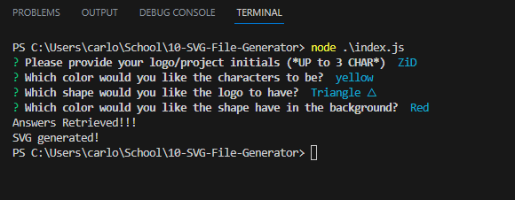
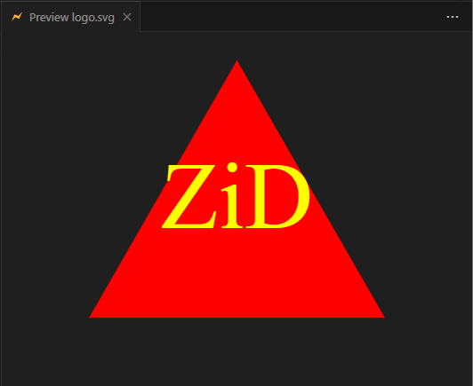
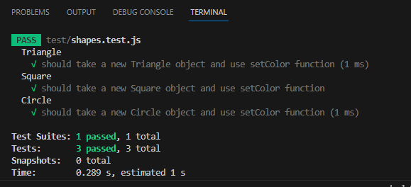

# 10-SVG-File-Generator By Carlos Osuna

[](https://opensource.org/licenses/MIT)

## Description:
    The program is intended to prompt a user with 4 questions regarding the criteria they want in order to generate a SVG logo. First the user is asked for the logo name(up to 3 characters), second for the text color, third for the shape of the logo and fourth for the color to fill the shape(background).


## User Story:
```
AS a freelance web developer
I WANT to generate a simple logo for my projects
SO THAT I don't have to pay a graphic designer
```

## Criteria:
```
GIVEN a command-line application that accepts user input
WHEN I am prompted for text
THEN I can enter up to three characters
WHEN I am prompted for the text color
THEN I can enter a color keyword (OR a hexadecimal number)
WHEN I am prompted for a shape
THEN I am presented with a list of shapes to choose from: circle, triangle, and square
WHEN I am prompted for the shape's color
THEN I can enter a color keyword (OR a hexadecimal number)
WHEN I have entered input for all the prompts
THEN an SVG file is created named `logo.svg`
AND the output text "Generated logo.svg" is printed in the command line
WHEN I open the `logo.svg` file in a browser
THEN I am shown a 300x200 pixel image that matches the criteria I entered
```

## Screenshots:

### Node.js Demo.


### SVG File Demo.


### Jest Demo.


## Video Walkthrough:
[SVG Generator Demo - Google Drive Link](https://drive.google.com/file/d/1mAgHUT-uEQpjJeyWJPOXLbLKakoY86Mn/view)

## GitRepo Link:
[GitHub Link](https://github.com/OkamiXX/10-SVG-File-Generator)


## Build/Developed with:
- JavaScript
- Node.js
- Inquirer.js
- Jest
- License Badge